# Communication Protocols — A Complete Guide

Think of the internet as a postal system. Every time you open a website, send a message, or stream a video, data is being shipped between computers using **communication protocols** — agreed-upon rules that both the sender and receiver follow so they can understand each other.

Let's break down each protocol one by one.

---

## Table of Contents

1. [TCP — Transmission Control Protocol](#1-tcp--transmission-control-protocol)
2. [UDP — User Datagram Protocol](#2-udp--user-datagram-protocol)
3. [HTTP — Hypertext Transfer Protocol](#3-http--hypertext-transfer-protocol)
4. [HTTPS — Hypertext Transfer Protocol Secure](#4-https--hypertext-transfer-protocol-secure)
5. [HTTP/3 (QUIC) — Quick UDP Internet Connections](#5-http3-quic--quick-udp-internet-connections)
6. [WebSocket](#6-websocket)
7. [FTP — File Transfer Protocol](#7-ftp--file-transfer-protocol)
8. [Protocol Comparison Table](#8-protocol-comparison-table)

---

## 1. TCP — Transmission Control Protocol

### What is it?

TCP is a **transport layer** protocol. It's the foundation that protocols like HTTP, HTTPS, and FTP are built on top of. Think of TCP as a **registered mail service** — it guarantees that your letter arrives, arrives in order, and arrives intact.

### How it works — The 3-Way Handshake

Before any data is sent, TCP establishes a **reliable connection** between the client and the server using a 3-step handshake:

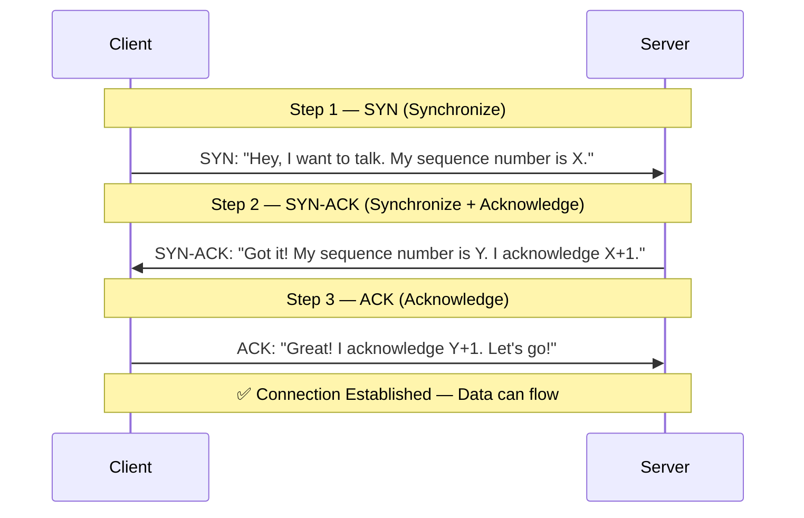

### How TCP guarantees reliability

| Mechanism | What it does |
|---|---|
| **Sequencing** | Each packet gets a sequence number so the receiver can reassemble them in the correct order, even if they arrive out of order. |
| **Acknowledgments (ACKs)** | The receiver sends back an ACK for every packet received. If the sender doesn't get an ACK within a timeout, it **retransmits** the packet. |
| **Checksum** | Each packet carries a checksum — a mathematical fingerprint of the data. The receiver recalculates it. If it doesn't match, the packet is discarded and retransmitted. |
| **Flow Control** | The receiver tells the sender how much data it can handle at a time (via a "window size"), preventing the receiver from being overwhelmed. |
| **Congestion Control** | TCP monitors the network for signs of congestion (packet loss, delays) and dynamically adjusts the sending rate. |

### Connection Teardown — The 4-Way Handshake

When the conversation is done, TCP gracefully closes the connection:

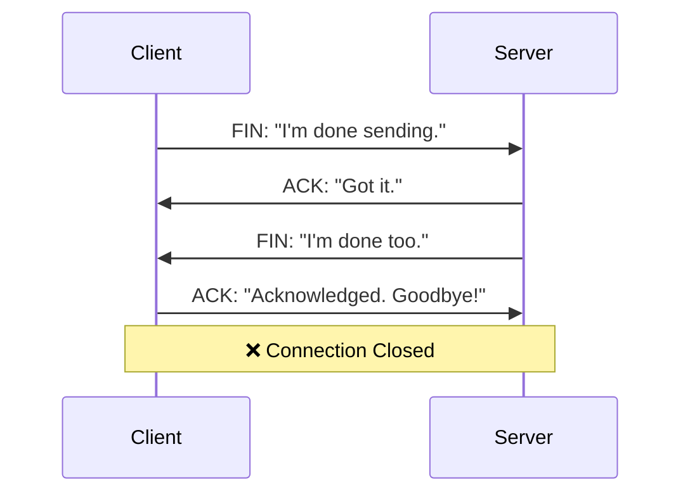

### Real-Life Use Cases

- **Web browsing** (HTTP/HTTPS runs over TCP)
- **Email** (SMTP, IMAP, POP3 all use TCP)
- **File transfers** (FTP, SFTP)
- **Database connections** (MySQL, PostgreSQL)
- Any scenario where **data integrity matters more than speed**

---

## 2. UDP — User Datagram Protocol

### What is it?

UDP is also a **transport layer** protocol, but it's the polar opposite of TCP. Think of UDP as **throwing postcards into a mailbox** — you send them and hope they arrive, but you don't wait for confirmation and you don't care about the order.

### How it works

There is **no handshake, no connection, no guarantees**. The sender simply fires off packets (called **datagrams**) to the receiver.

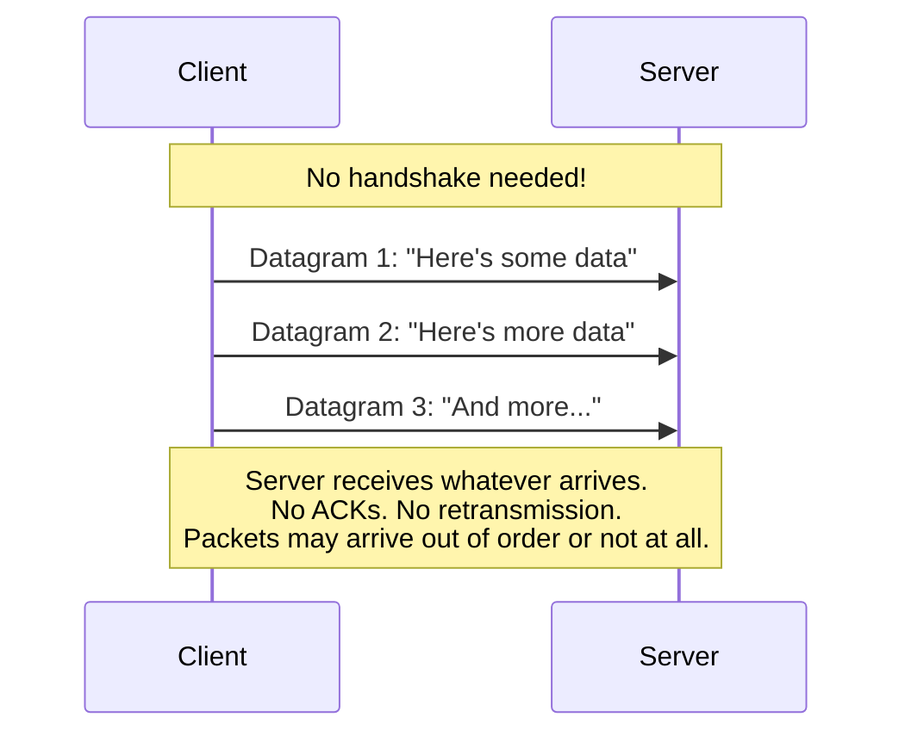

### TCP vs UDP — Side by Side

| Feature | TCP | UDP |
|---|---|---|
| Connection | Connection-oriented (handshake) | Connectionless (fire and forget) |
| Reliability | Guaranteed delivery | No guarantee |
| Ordering | Packets arrive in order | Packets may arrive out of order |
| Speed | Slower (overhead from ACKs, retransmission) | Faster (minimal overhead) |
| Header Size | 20-60 bytes | 8 bytes |
| Use Case | When accuracy matters | When speed matters |

### Real-Life Use Cases

- **Video streaming** (Netflix, YouTube) — a dropped frame is better than buffering
- **Online gaming** — old position data is useless; you need the latest one fast
- **Voice/Video calls** (Zoom, Discord) — slight glitches are acceptable; lag is not
- **DNS lookups** — small, fast queries
- **IoT sensor data** — constant stream of small readings

---

## 3. HTTP — Hypertext Transfer Protocol

### What is it?

HTTP is an **application layer** protocol built **on top of TCP**. It defines how a client (your browser) and a server communicate. Every time you type a URL and press Enter, HTTP is at work.

HTTP follows a **request-response model** — the client asks, the server answers. That's it. The server never spontaneously sends data to the client.

### How it works

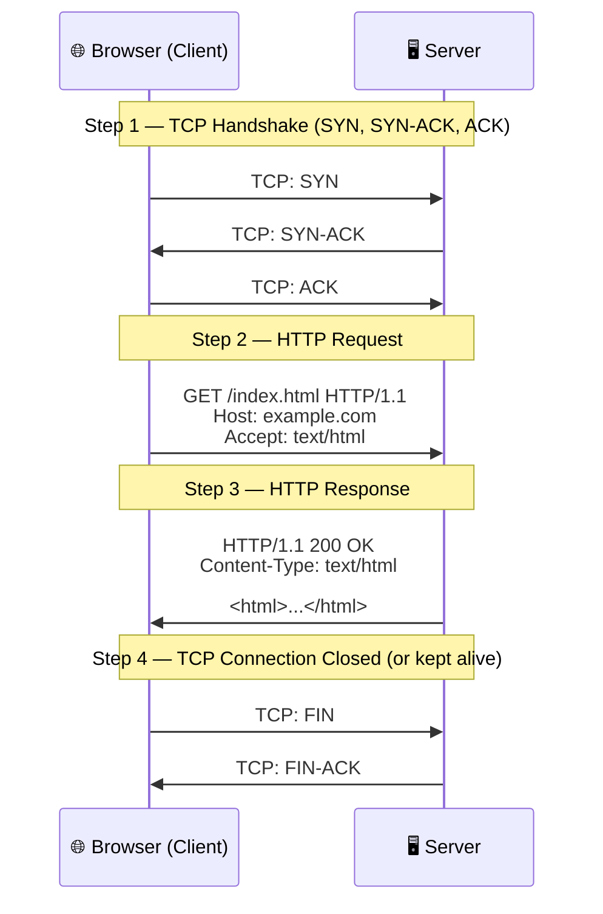

### Anatomy of an HTTP Request

```
GET /api/users HTTP/1.1          ← Method + Path + Version
Host: example.com                ← Which server
Accept: application/json         ← What format I want
Authorization: Bearer abc123     ← Authentication
Content-Type: application/json   ← Format of body (for POST/PUT)
```

### HTTP Methods

| Method | Purpose | Idempotent? | Has Body? |
|---|---|---|---|
| `GET` | Retrieve data | Yes | No |
| `POST` | Create a resource | No | Yes |
| `PUT` | Replace a resource entirely | Yes | Yes |
| `PATCH` | Partially update a resource | No | Yes |
| `DELETE` | Remove a resource | Yes | No |
| `HEAD` | Same as GET but no body | Yes | No |
| `OPTIONS` | Check what methods are allowed | Yes | No |

### HTTP Status Codes

| Range | Category | Examples |
|---|---|---|
| `1xx` | Informational | `100 Continue` |
| `2xx` | Success | `200 OK`, `201 Created`, `204 No Content` |
| `3xx` | Redirection | `301 Moved Permanently`, `304 Not Modified` |
| `4xx` | Client Error | `400 Bad Request`, `401 Unauthorized`, `404 Not Found`, `429 Too Many Requests` |
| `5xx` | Server Error | `500 Internal Server Error`, `502 Bad Gateway`, `503 Service Unavailable` |

### HTTP Versions at a Glance

| Version | Key Feature |
|---|---|
| HTTP/1.0 | One request per TCP connection |
| HTTP/1.1 | **Keep-alive** connections (reuse TCP), pipelining |
| HTTP/2 | **Multiplexing** (multiple requests over one TCP connection), header compression, server push |
| HTTP/3 | Built on **QUIC (UDP)** instead of TCP — see section below |

### Real-Life Use Cases

- Every website you visit
- REST APIs (`GET /api/products`, `POST /api/orders`)
- Loading images, scripts, stylesheets
- Form submissions

---

## 4. HTTPS — Hypertext Transfer Protocol Secure

### What is it?

HTTPS is **HTTP + TLS (Transport Layer Security)**. It encrypts the communication between client and server so no one in the middle (hackers, ISPs, governments) can read or tamper with the data.

Think of HTTP as a **postcard** (anyone handling it can read it) and HTTPS as a **sealed envelope** (only the recipient can open it).

### How it works — The TLS Handshake

Before any HTTP data flows, a TLS handshake happens **on top of the TCP handshake**:

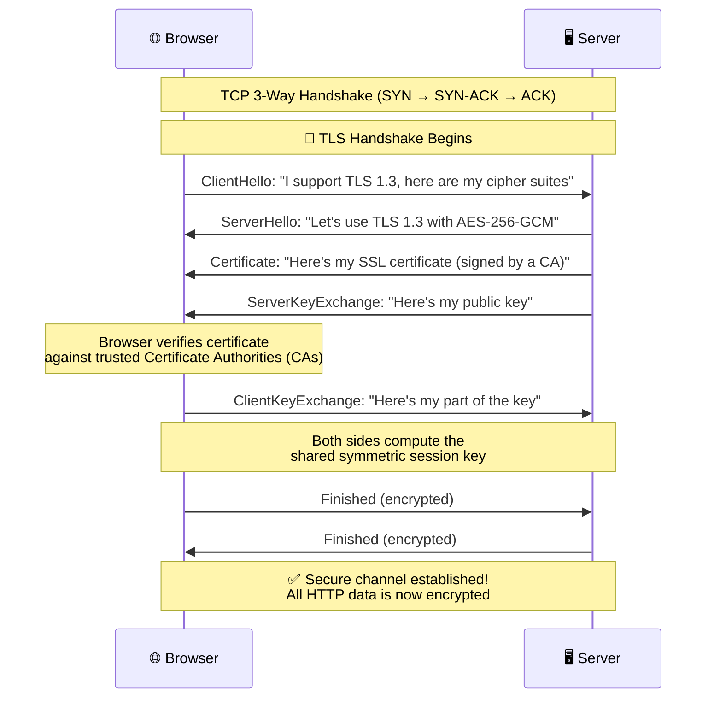

### What TLS protects against

| Threat | How TLS prevents it |
|---|---|
| **Eavesdropping** | All data is encrypted — even if intercepted, it's unreadable |
| **Tampering** | Message Authentication Code (MAC) detects any modification |
| **Impersonation** | SSL certificates verify the server is who it claims to be |
| **Man-in-the-Middle (MITM)** | Certificate verification + encryption together prevent MITM attacks |

### Symmetric vs Asymmetric Encryption in HTTPS

```
1. Asymmetric encryption (slow but secure) is used ONLY during the TLS handshake
   to safely exchange a symmetric key.

2. Symmetric encryption (fast) is used for ALL actual data transfer
   after the handshake is complete.

This gives you the best of both worlds — security AND speed.
```

### Real-Life Use Cases

- **Every modern website** (browsers show a 🔒 padlock for HTTPS)
- **Online banking & payments**
- **Login pages** — passwords are encrypted in transit
- **APIs** — securing data between services
- **Any site handling sensitive data** (medical, legal, personal)

---

## 5. HTTP/3 (QUIC) — Quick UDP Internet Connections

### What is it?

HTTP/3 is the **latest version of HTTP**, and it makes a radical change: instead of running on **TCP**, it runs on **QUIC**, which is built on **UDP**.

Why? TCP has a fundamental problem called **Head-of-Line Blocking** — if one packet is lost, ALL streams on that connection are blocked until the lost packet is retransmitted. QUIC solves this.

### The Problem with HTTP/2 over TCP

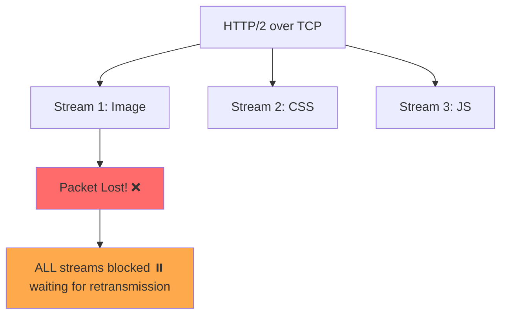

### How QUIC (HTTP/3) solves it

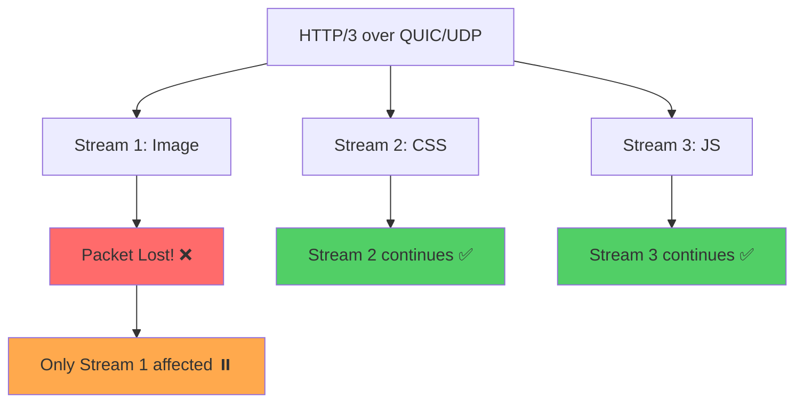

### How it works

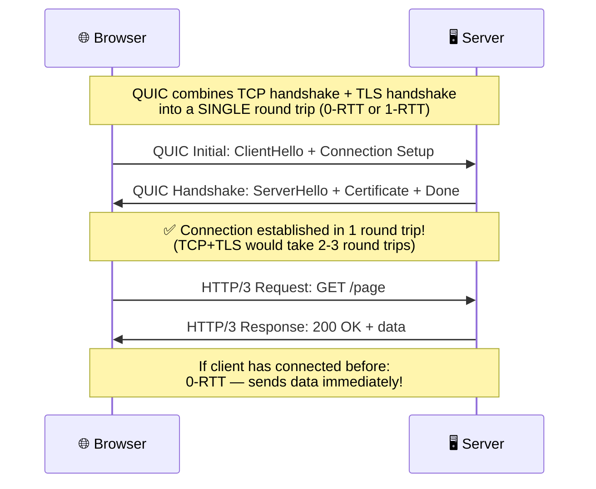

### Key advantages of HTTP/3

| Feature | Benefit |
|---|---|
| **No Head-of-Line Blocking** | Lost packets only affect their own stream, not others |
| **Faster Connection Setup** | 1-RTT (or 0-RTT for returning visitors) vs 2-3 RTT for TCP+TLS |
| **Built-in Encryption** | TLS 1.3 is mandatory and integrated, not layered on top |
| **Connection Migration** | Switching from Wi-Fi to cellular doesn't break the connection (uses Connection IDs, not IP+Port) |
| **Better on lossy networks** | Mobile networks, Wi-Fi with interference |

### Real-Life Use Cases

- **Google services** (YouTube, Gmail, Google Search — Google invented QUIC)
- **Cloudflare** and other CDNs
- **Facebook / Meta**
- Any application where **low latency** on **unreliable networks** is critical

---

## 6. WebSocket

### What is it?

WebSocket is a protocol that provides **full-duplex** (two-way), **persistent** communication over a **single TCP connection**. Unlike HTTP where the client always initiates, with WebSocket **both the client and server can send messages at any time**.

Think of HTTP as **walkie-talkie** (one talks, the other listens, then they switch). WebSocket is a **phone call** (both can talk simultaneously).

### How it works

WebSocket starts as an HTTP request (called the **upgrade handshake**), then upgrades to a persistent WebSocket connection:

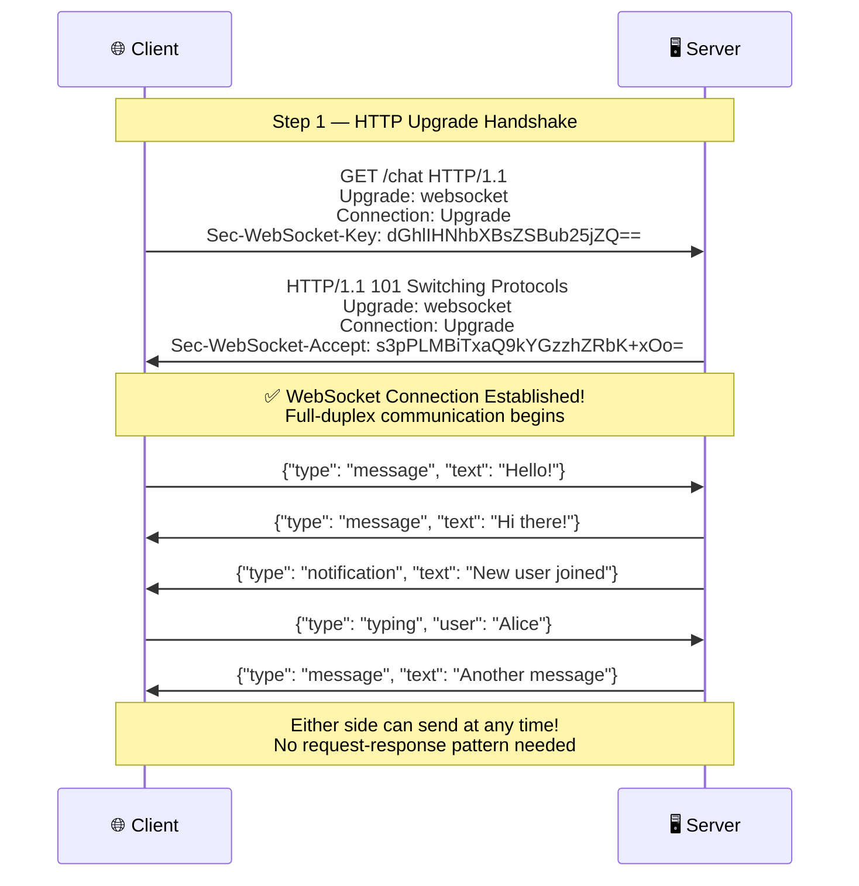

### HTTP Polling vs WebSocket

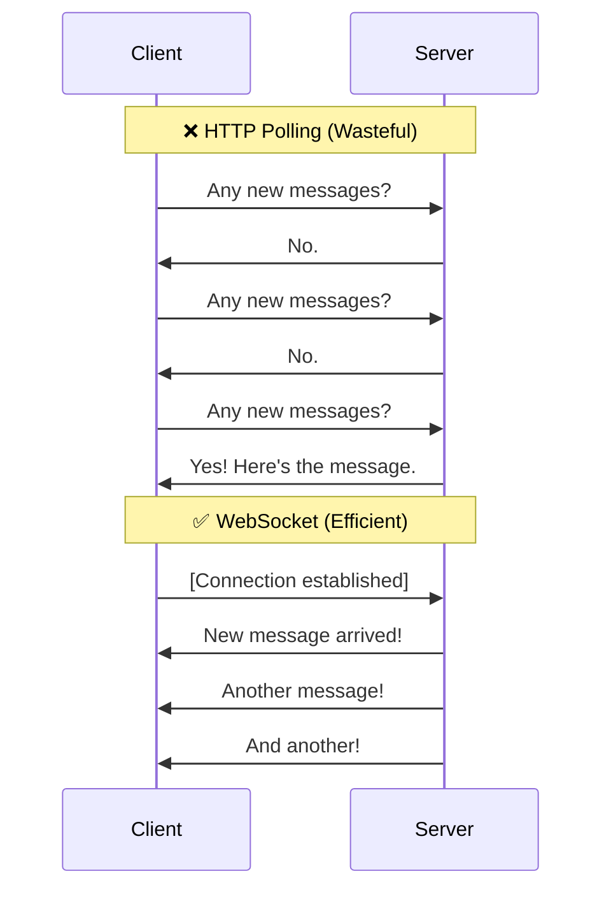

### Real-Life Use Cases

- **Chat applications** (Slack, WhatsApp Web, Discord)
- **Real-time notifications** (push notifications in web apps)
- **Live dashboards** (stock tickers, analytics dashboards)
- **Collaborative editing** (Google Docs, Figma)
- **Online multiplayer games**
- **Live sports scores**

---

## 7. FTP — File Transfer Protocol

### What is it?

FTP is one of the **oldest protocols** on the internet (1971!). It's specifically designed for **transferring files** between a client and a server. Think of it as a **dedicated file courier service**.

### How it works

FTP is unique because it uses **two separate TCP connections**:

1. **Control Connection (Port 21)** — for sending commands (login, navigate directories, request files)
2. **Data Connection (Port 20)** — for actually transferring the file data

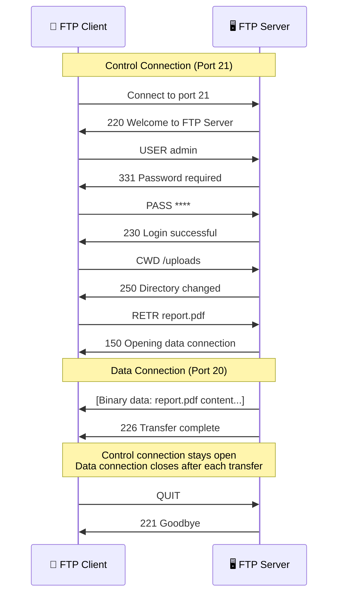

### FTP Modes

| Mode | How Data Connection Works | Firewall Friendly? |
|---|---|---|
| **Active Mode** | Server connects TO the client on a random port | No — firewalls often block incoming connections |
| **Passive Mode** | Client connects TO the server on a port the server specifies | Yes — client initiates both connections |

### FTP vs Modern Alternatives

| Protocol | Encrypted? | Use Case |
|---|---|---|
| **FTP** | ❌ No (plain text, even passwords!) | Legacy systems only |
| **FTPS** | ✅ FTP + TLS encryption | Secure file transfer (FTP with SSL) |
| **SFTP** | ✅ Runs over SSH | Secure file transfer (completely different protocol) |
| **SCP** | ✅ Runs over SSH | Simple secure file copy |

> ⚠️ **Warning:** Plain FTP sends everything (including passwords) in **clear text**. Never use plain FTP for sensitive data. Use **SFTP** or **FTPS** instead.

### Real-Life Use Cases

- **Web hosting** — uploading website files to a server
- **Backup systems** — transferring backup files to remote storage
- **Legacy enterprise systems** — many older systems still use FTP
- **Large file distribution** — sharing large files within organizations

---

## 8. Protocol Comparison Table

| Protocol | Layer | Built On | Connection | Reliable? | Encrypted? | Duplex | Speed |
|---|---|---|---|---|---|---|---|
| **TCP** | Transport | IP | Connection-oriented | ✅ Yes | ❌ No | Full | Moderate |
| **UDP** | Transport | IP | Connectionless | ❌ No | ❌ No | Full | Fast |
| **HTTP** | Application | TCP | Request-Response | ✅ Yes | ❌ No | Half | Moderate |
| **HTTPS** | Application | TCP + TLS | Request-Response | ✅ Yes | ✅ Yes | Half | Moderate |
| **HTTP/3** | Application | QUIC (UDP) | Request-Response | ✅ Yes | ✅ Yes | Half | Fast |
| **WebSocket** | Application | TCP | Persistent | ✅ Yes | Optional (WSS) | Full | Fast |
| **FTP** | Application | TCP | Dual TCP | ✅ Yes | ❌ No | Half | Moderate |

---

## 9. The Full Picture — How They Stack Together

```
┌─────────────────────────────────────────────────────────┐
│                   APPLICATION LAYER                      │
│  ┌──────┐ ┌───────┐ ┌────────┐ ┌───────────┐ ┌───────┐ │
│  │ HTTP │ │ HTTPS │ │ HTTP/3 │ │ WebSocket │ │  FTP  │ │
│  └──┬───┘ └──┬────┘ └───┬────┘ └─────┬─────┘ └──┬────┘ │
├─────┼────────┼─────────┼────────────┼───────────┼───────┤
│     │   ┌────┴───┐  ┌──┴───┐        │           │       │
│     │   │  TLS   │  │ QUIC │        │           │       │
│     │   └────┬───┘  └──┬───┘        │           │       │
├─────┼────────┼─────────┼────────────┼───────────┼───────┤
│                   TRANSPORT LAYER                        │
│         ┌─────────┐    ┌─────────┐                       │
│         │   TCP   │    │   UDP   │                       │
│         └────┬────┘    └────┬────┘                       │
├──────────────┼──────────────┼────────────────────────────┤
│                   NETWORK LAYER                          │
│              ┌──────────────┐                            │
│              │      IP      │                            │
│              └──────────────┘                            │
└─────────────────────────────────────────────────────────┘

HTTP, HTTPS, WebSocket, FTP  →  use TCP
HTTP/3                       →  uses QUIC which uses UDP
HTTPS                        →  adds TLS on top of TCP
```

---

## 10. Interview Quick-Fire Answers

**Q: What's the difference between TCP and UDP?**
> TCP is reliable and ordered (3-way handshake, ACKs, retransmission). UDP is fast and unreliable (fire-and-forget). Use TCP when data accuracy matters (web, email). Use UDP when speed matters (gaming, streaming, DNS).

**Q: How does HTTPS work?**
> HTTPS = HTTP + TLS. After the TCP handshake, a TLS handshake exchanges keys using asymmetric encryption. Then all data flows using fast symmetric encryption. The SSL certificate verifies the server's identity.

**Q: What is HTTP/3 and why does it exist?**
> HTTP/3 runs on QUIC (UDP-based) instead of TCP to eliminate head-of-line blocking. If one stream loses a packet, other streams aren't affected. It also has faster connection setup (1-RTT or 0-RTT).

**Q: When would you use WebSocket over HTTP?**
> When you need real-time, bidirectional communication. HTTP is request-response only — the server can't push data to the client. WebSocket keeps a persistent connection open where both sides can send data anytime.

**Q: Why does FTP use two connections?**
> Separation of concerns. The control connection (port 21) handles commands and responses. The data connection (port 20) handles file transfer. This way, you can browse directories while a file is transferring.
