# How the Web Works

A deep dive into what happens from the moment you type a URL into your browser until the page is fully rendered on your screen.

---

## 1. Client-Server Architecture

The web operates on a **client-server model**. The client (your browser) sends a **request** and the server sends back a **response**.

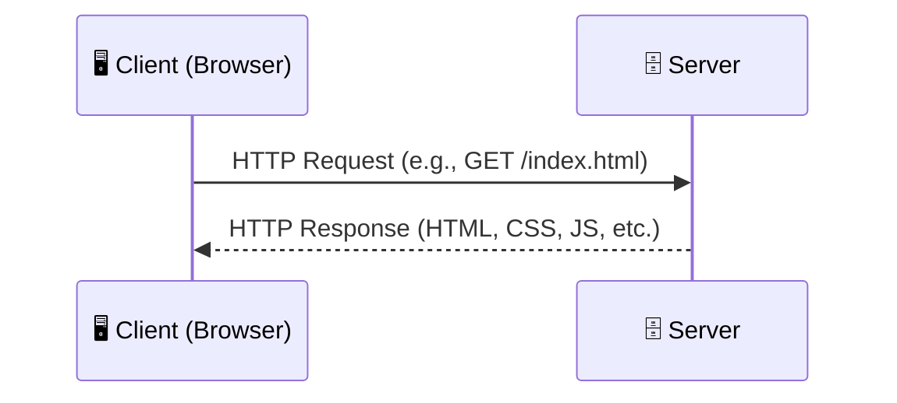

### What is a Server?

A server is just a machine — it can be a simple laptop, a desktop PC, or a high-end rack-mounted server. What makes it a "server" is that it **listens for and responds to requests** from other machines.

For production systems, we use powerful, purpose-built machines to ensure:

- **High availability** — the server stays online 24/7
- **High throughput** — it can handle thousands of concurrent requests
- **Low latency** — responses are fast

> **Key Insight:** Any computer can be a server. When you run `localhost:3000` during development, your own machine is acting as the server.

---

## 2. IP Addresses & Domain Names

To connect a client to a server, we need an **address** — the **IP address**. Every machine on the internet has a unique IP address (e.g., `142.250.190.46` for Google).

But humans don't memorize IP addresses. We use **domain names** like `google.com` instead. The system that translates domain names to IP addresses is called **DNS (Domain Name System)**.

### Domain Name Structure

A domain name like `www.google.com` is broken into hierarchical parts:

```
www.google.com.
 │    │     │  └── Root Domain (implicit, usually hidden)
 │    │     └───── Top-Level Domain (TLD): .com, .org, .io
 │    └─────────── Second-Level Domain (SLD): google
 └──────────────── Third-Level Domain (subdomain): www
```

| Level | Example | Description |
|-------|---------|-------------|
| Root | `.` | The root of the DNS hierarchy (usually invisible) |
| TLD | `.com` | Managed by registries (e.g., Verisign for `.com`) |
| SLD | `google` | The name you actually register |
| Subdomain | `www` | Optional prefix, can be anything (`mail`, `api`, `docs`) |

---

## 3. DNS Lookup — Resolving a Domain Name

When you type `google.com` in your browser, a chain of lookups happens to resolve it into an IP address.

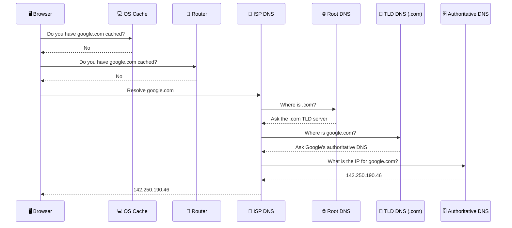

### DNS Resolution Steps

1. **Browser cache** — The browser checks its own cache first.
2. **OS cache** — The operating system has a DNS cache too.
3. **Router cache** — Your home router may have it cached.
4. **ISP DNS resolver** — Your Internet Service Provider's recursive resolver kicks in.
5. **Root DNS server** — Knows where TLD servers are (`.com`, `.org`, etc.).
6. **TLD DNS server** — Knows which authoritative server handles `google.com`.
7. **Authoritative DNS server** — Returns the actual IP address.

> **Mobile devices** follow a similar path: the phone connects to a **cell tower**, then the **carrier's DNS resolver**, and the same hierarchy applies from there.

---

## 4. TCP Handshake — Establishing a Connection

Once the browser has the IP address, it needs to establish a reliable connection with the server. This is done using the **TCP three-way handshake**.

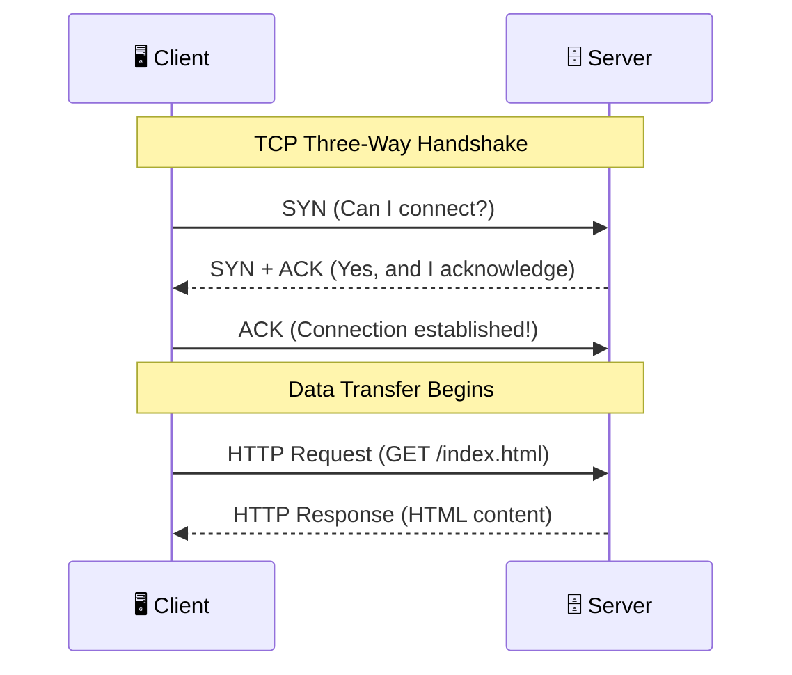

| Step | Packet | Purpose |
|------|--------|---------|
| 1 | **SYN** | Client asks to synchronize/connect |
| 2 | **SYN+ACK** | Server acknowledges and agrees to connect |
| 3 | **ACK** | Client confirms — connection is now open |

After the handshake, data flows in both directions over this reliable connection.

---

## 5. TLS/SSL Handshake — Securing the Connection (HTTPS)

For secure websites (HTTPS), an additional **TLS handshake** happens after TCP, but before any HTTP data is exchanged.

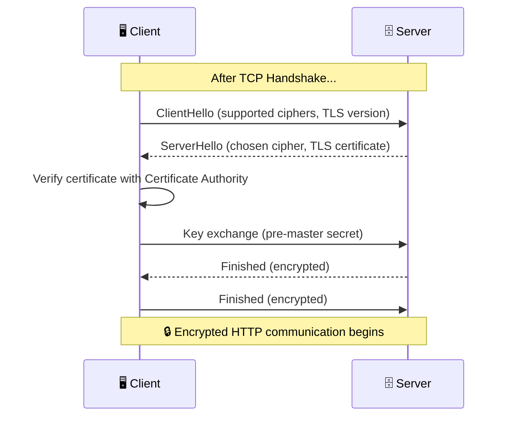

### Full Connection Sequence for HTTPS

```
DNS Lookup → TCP Handshake → TLS/SSL Handshake → HTTP Request/Response
```

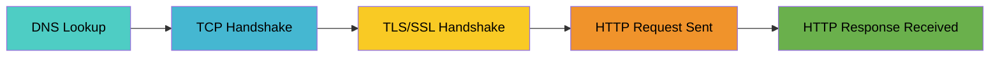

---

## 6. HTTP Request & Response

Once the connection is established, the browser sends an HTTP request and the server responds.

### First Request — The HTML Document

The very first file fetched is always **`index.html`** (or the equivalent HTML document). The browser parses this HTML to discover additional resources it needs.

```http
GET / HTTP/1.1
Host: www.google.com
Accept: text/html
User-Agent: Mozilla/5.0 ...
```

```http
HTTP/1.1 200 OK
Content-Type: text/html; charset=UTF-8
Content-Length: 12345

<!DOCTYPE html>
<html>
  <head>
    <link rel="stylesheet" href="styles.css" />
    <script src="app.js" defer></script>
  </head>
  <body>...</body>
</html>
```

### Status Codes to Know

| Code | Meaning | What Happens |
|------|---------|--------------|
| **200** | OK | Fresh resource fetched successfully |
| **304** | Not Modified | Browser uses its cached version (saves bandwidth!) |
| **301** | Moved Permanently | Redirect to new URL |
| **404** | Not Found | Resource doesn't exist |
| **500** | Internal Server Error | Something broke on the server |

> **304 Not Modified:** If the browser already has a cached copy of a resource and it hasn't changed on the server, the server responds with `304`. The browser skips the download and uses the cached file. This is part of **HTTP caching** and dramatically improves performance.

---

## 7. Fetching Subsequent Resources

After receiving the HTML, the browser discovers `<link>`, `<script>`, and `` tags that reference additional files. These are fetched via new HTTP requests.

### Parallel Connection Limits

Browsers limit the number of **simultaneous connections** per domain — typically **6 to 8** connections in parallel. Any additional requests are **queued** and wait for a connection to free up.

```mermaid
gantt
    title Browser Parallel Resource Fetching (6 connection limit)
    dateFormat X
    axisFormat %s

    section Connection 1
    styles.css          :0, 3
    image3.png          :3, 6

    section Connection 2
    app.js              :0, 4
    image4.png          :4, 7

    section Connection 3
    vendor.js           :0, 5

    section Connection 4
    image1.png          :0, 2
    font.woff2          :2, 5

    section Connection 5
    image2.png          :0, 3
    analytics.js        :3, 4

    section Connection 6
    favicon.ico         :0, 1
    image5.png          :1, 4

    section Queued
    image6.png          :4, 7
```

> **Tip:** This is why techniques like **domain sharding**, **HTTP/2 multiplexing**, and **bundling** exist — to work around or eliminate this connection limit.

### Service Workers

Resources can also be served by a **Service Worker** — a script that acts as a proxy between the browser and the network.

```javascript
self.addEventListener("fetch", (event) => {
  event.respondWith(
    caches.match(event.request).then((cachedResponse) => {
      // Return cached version or fetch from network
      return cachedResponse || fetch(event.request);
    })
  );
});
```

In the DevTools Network tab, service-worker-served requests show timing info:

- **`startup`** — Time for the service worker to boot up
- **`respondWith`** — Time for the service worker to produce a response

---

## 8. How a Page is Rendered — The Critical Rendering Path

Once resources start arriving, the browser begins rendering. This is a multi-stage pipeline:


### Step-by-Step Breakdown

---

### Step 1: DOM Construction

The browser parses the HTML and builds the **DOM (Document Object Model)** — a tree representation of every element on the page.

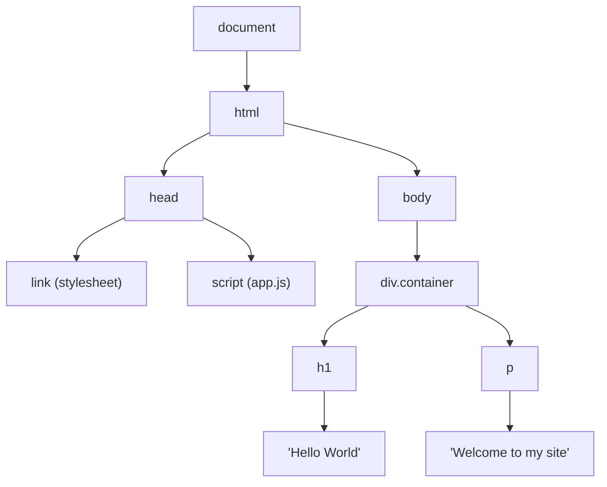

```html
<!DOCTYPE html>
<html>
  <head>
    <link rel="stylesheet" href="styles.css" />
    <script src="app.js" defer></script>
  </head>
  <body>
    <div class="container">
      <h1>Hello World</h1>
      <p>Welcome to my site</p>
    </div>
  </body>
</html>
```

---

### Step 2: CSSOM Construction

The browser parses CSS files and constructs the **CSSOM (CSS Object Model)** — a tree of all styles that apply to each element.

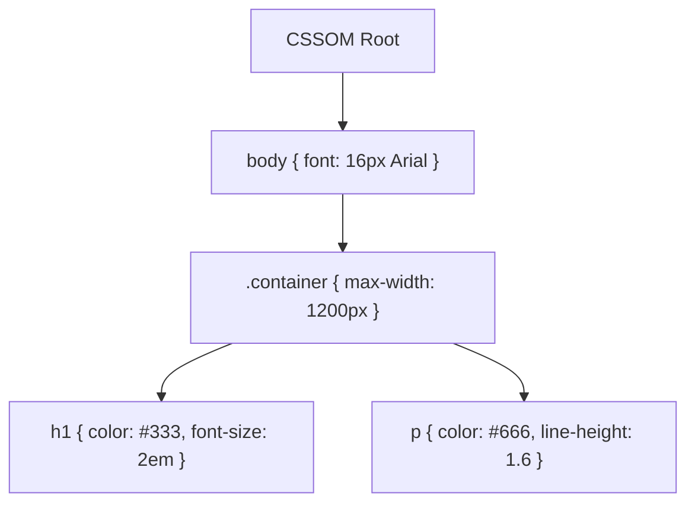

> **Render-blocking:** CSS is render-blocking. The browser will **not render anything** until the CSSOM is fully constructed. There's no point building the render tree without knowing what styles to apply.

---

### Step 3: JavaScript Execution

While parsing HTML, when the browser encounters a `<script>` tag:

1. The script is **loaded** and **parsed** (main thread is blocked unless `async`/`defer` is used)
2. An **AST (Abstract Syntax Tree)** is created
3. The code is **compiled into bytecode** by the JS engine (V8, SpiderMonkey, etc.)
4. **Execution** happens


> **Parser-blocking:** JavaScript blocks HTML parsing because JS can modify the DOM (e.g., `document.write()`). Use `async` or `defer` to make scripts non-blocking.

```html
<!-- Blocks parsing until script is downloaded and executed -->
<script src="app.js"></script>

<!-- Downloads in parallel, executes after HTML is fully parsed -->
<script src="app.js" defer></script>

<!-- Downloads in parallel, executes as soon as downloaded -->
<script src="app.js" async></script>
```

```mermaid
gantt
    title Script Loading Strategies
    dateFormat X
    axisFormat %s

    section Normal
    HTML Parsing     :a1, 0, 3
    Script Download  :a2, 3, 5
    Script Execute   :a3, 5, 6
    HTML Parsing     :a4, 6, 8

    section Async
    HTML Parsing     :b1, 0, 3
    Script Download  :b2, 1, 3
    Script Execute   :crit, b3, 3, 4
    HTML Parsing     :b4, 4, 8

    section Defer
    HTML Parsing     :c1, 0, 8
    Script Download  :c2, 1, 3
    Script Execute   :c3, 8, 9
```

---

### Step 4: Render Tree Formation

The **DOM** and **CSSOM** are merged to form the **Render Tree**. The render tree only contains **visible** elements — things like `display: none` elements or `<head>` are excluded.

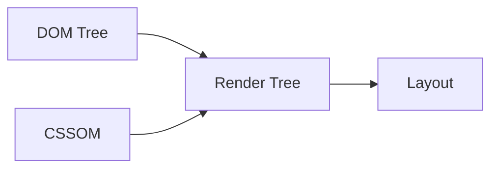

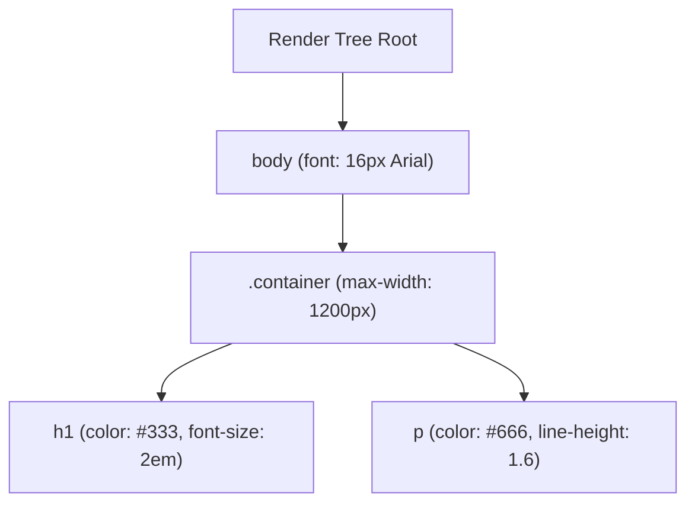

> Elements with `display: none` are in the DOM but **not** in the render tree. Elements with `visibility: hidden` **are** in the render tree (they still take up space).

---

### Step 5: Layout (Reflow)

The browser calculates the **exact position and size** of every element in the render tree. This is called **layout** or **reflow**.

- Converts relative units (`%`, `em`, `vh`) to absolute pixel values
- Determines bounding box geometry for each node

> **Performance tip:** Triggering layout repeatedly (reading `.offsetWidth` then modifying styles in a loop) causes **layout thrashing** and kills performance.

---

### Step 6: Painting

The browser fills in pixels — colors, text, images, borders, shadows. Each element is painted on its respective layer.

---

### Step 7: Compositing

Different **layers** are combined into the final image. The browser creates separate layers for elements that need independent rendering, such as:

- Elements with `position: fixed` or `position: absolute`
- Elements with `transform: translateZ(0)` (forces GPU acceleration)
- Elements with the `will-change` property
- Elements with different `z-index` values

```javascript
const cardStyle = {
  padding: "20px",
  backgroundColor: "#fff",
  borderRadius: "8px",
  transform: isHovering ? "scale(1.05)" : "scale(1)",
  transition: "transform 0.3s ease",
  willChange: isHoverable ? "transform" : "auto",
};
```

> The `will-change` property tells the browser to promote the element to its own compositing layer **ahead of time**, enabling hardware-accelerated (GPU) rendering for smoother animations.

---

### Step 8: Displaying

The composited layers are sent to the **GPU**, which draws the final pixels on your screen. The page is now visible!

---

## 9. Full Journey — From URL to Pixels

Here's the entire process in one diagram:

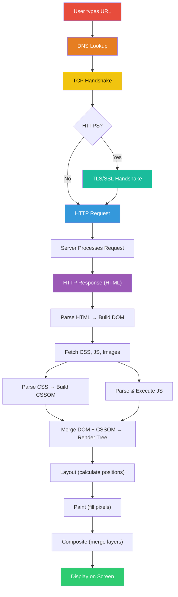

---

## 10. Summary Cheat Sheet

| Phase | What Happens |
|-------|-------------|
| **DNS Lookup** | Domain name → IP address |
| **TCP Handshake** | SYN → SYN+ACK → ACK (reliable connection) |
| **TLS Handshake** | Certificate exchange + encryption setup |
| **HTTP Request** | Browser requests resources from server |
| **Loading** | HTML downloaded, parsed for sub-resources |
| **DOM Construction** | HTML → DOM tree |
| **CSSOM Construction** | CSS → CSSOM tree (render-blocking) |
| **JS Execution** | Parse → AST → Bytecode → Execute (parser-blocking) |
| **Render Tree** | DOM + CSSOM merged (visible elements only) |
| **Layout** | Calculate size and position of every element |
| **Paint** | Fill in pixels for each layer |
| **Composite** | Merge layers using GPU |
| **Display** | Final pixels on screen |
